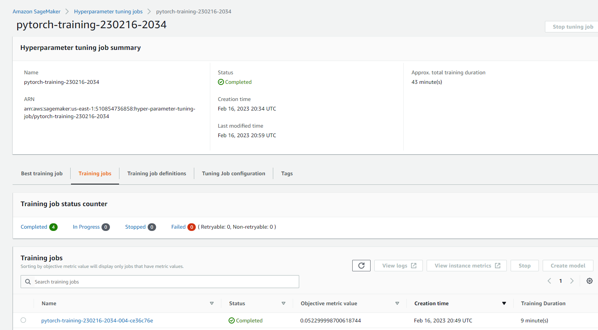
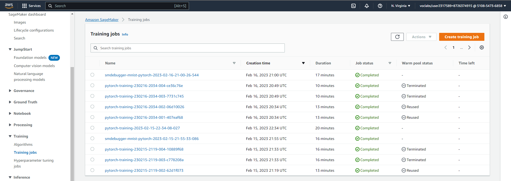
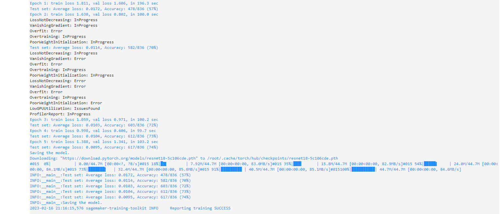
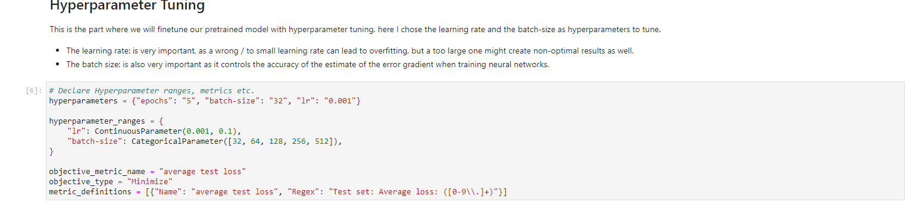
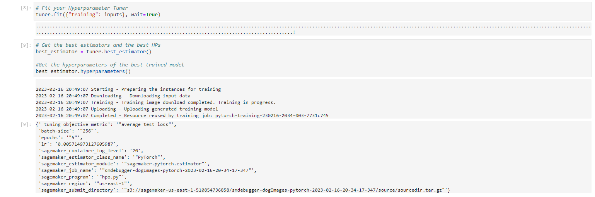
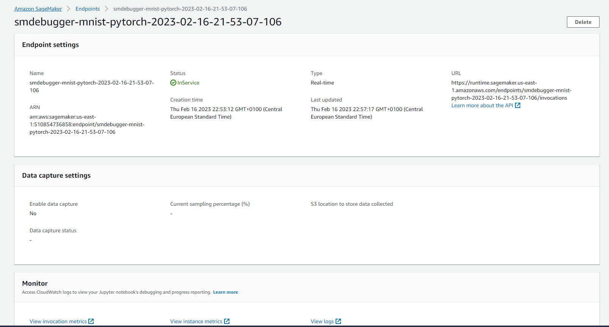

# Image Classification using AWS SageMaker

The goal of this project is to Use AWS Sagemaker to train a pretrained model that can perform image classification by using the Sagemaker profiling, debugger, hyperparameter tuning and other good ML engineering practices. in this Notebook we will use the datasets provided from the class to idetify the dog breed. 

## Project Set Up and Installation
- First we need to enter AWS through the gateway and open SageMaker Studio. then launching the SageMaker Studio, Downloading the starter files making the dataset available to us.
- Second we need to Install any packages required for the project.

## Dataset
The provided dataset is the dogbreed classification dataset which can be found in the classroom. The image data is divided into train, test and validation datasets. Each contains the 133 classes of the dogs that can be identified.

### Access
Upload the data to an S3 bucket through the AWS Gateway so that SageMaker has access to the data. 

## Hyperparameter Tuning
This is the part where we will finetune our pretrained model with hyperparameter tuning. here I chose the learning rate and the batch-size as hyperparameters to tune. 
- The learning rate: is very important, as a wrong / to small learning rate can lead to overfitting, but a too large one might create non-optimal results as well. 
- The batch size: is also very important as it controls the accuracy of the estimate of the error gradient when training neural networks.

### Screenshots of training jobs

### Logs metrics during the training process

### Tune at least two hyperparameters

### Retrieve the best hyperparameters from all your training jobs
Best hyperparameters for training are : {'_tuning_objective_metric': '"average test loss"',
                                         'batch-size': '"256"',
                                         'epochs': '"5"',
                                         'lr': '0.005714973127605987'}
                                         

## Debugging and Profiling

#### Results
The validation error decreases after a few training steps and fluctuates.  One idea would be to check when the loss no longer fluctuates and in that case, stop training earlier.

Some insights: 
The profiler report shows that my training job took 951 seconds. 

BatchSize: the profiler noticed that the batch size is too small, and the GPUs are underutilized. we need to consider using a smaller instance type or increasing the batch size.

StepOutlier: the profiler detected outliers in the step duration. The step duration for a forward and reverse pass should be approximately the same throughout the training. If there are significant outliers, it may indicate system blocking or bottleneck problems.

Data Loaders: we need to consider increasing the number of data loaders or implementing data prefetching.

Load balancing: we need to choose a different distributed training strategy or a different distributed training framework.

## Model Deployment
To query the endpoint, we need to create an endpoint and then take a test image that needs to be transformed using the same transformer in our training function before being fed into the prediction function.

